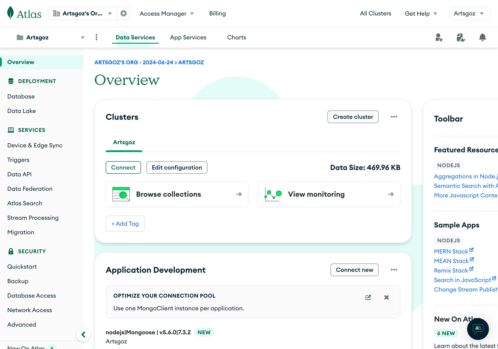

# Database Configuring

## Access to the Database

Please go [https://cloud.mongodb.com/](https://cloud.mongodb.com/) and sign in via GoogleOAuth (make sure you are logging in by Artsgoz IT account) so you can see the organization page and choose the Artsgoz Project. Then, you will see the clusters.&#x20;

<figure><figcaption>
the overview page of the clusters
</figcaption></figure>

## Collections in database

You can see the details of the collections in the database by clicking the Database in the Deployment section. Then, the collections page will appear.

<figure><figcaption>
The collections page
</figcaption></figure>

From the image above, you can see the collections inside the test database. This was completely set up. So, if there's no errors, please do not visit this page due to securities reasons.&#x20;

## Creating the collection

You cannot create the collection by proceeding directly from the webpage. You need to manage it by creating schema file, creating api from the server project and send the data via the API Endpoint you created.&#x20;

## Objects in the collections

The objects in the collections will appear when it's created. You can create the object by sending POST via the API Endpoint.

## About the `ajarns` Collection

The `ajarns` collection in the database is the collection contains the faculty staff lists and strictly prohibited from conducting any actions.


DO NOT PERFORM ANY ACTION IN THE `ajarns` OBJECT WITHOUT PERMISSIONS

